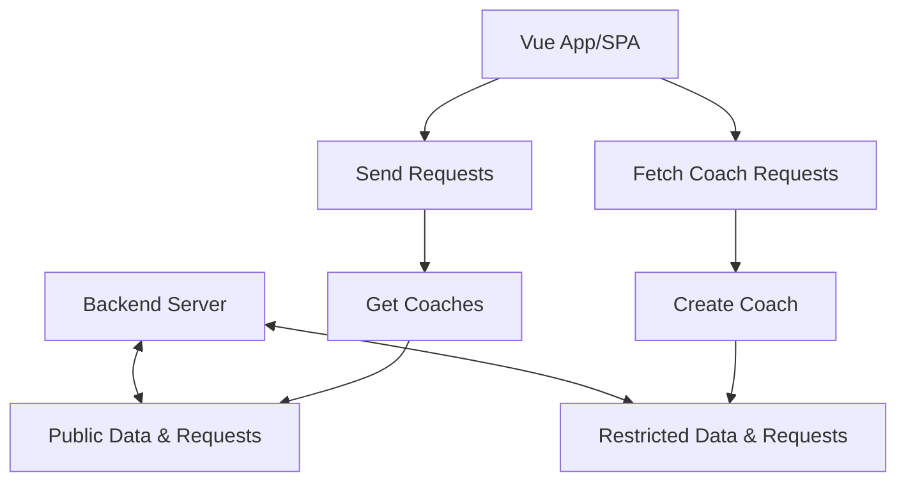

3 hours
296
# Vue
## Ways to Use It
1. Can control parts of the webpage (don't have to use Vue for all parts of the page) (Widgets)
2. Everything uses Vue (SPA, single page app)
	1. Server only sends one HTML page, and thereafter Vue takes over

*Lets us build a more declarative app, rather than imperative*

## Vue vs Other Tools
- Vue
	- Component based UI
- React
	- Library
	- Less features than Vue
	- Lots of community packages
- Angular
	- Component based UI
	- Uses TS
	- Can be overkill for smaller projects

## Create Vue App

```bash
npm create vue@latest
cd vue-project
npm install
npm run dev
```

OR

```bash
npm vue init
cd vue-project
npm install
npm run dev
```

Server will run on: http://localhost:5173/

## Basic Vue Definition
### package.json
```js
{
  "name": "vue-project",
  "version": "0.0.0",
  "private": true,
  "scripts": {
    "dev": "vite",
    "build": "vite build",
    "preview": "vite preview"
  },
  "dependencies": {
    "vue": "^3.3.4"
  },
  "devDependencies": {
    "@vitejs/plugin-vue": "^4.2.3",
    "vite": "^4.4.6"
  }
}

```
### index.html
```html
<!DOCTYPE html>
<html lang="en">
  <body>
    <div id="app"></div>
    <script type="module" src="/src/main.js"></script>
  </body>
</html>
```
### src/main.js
```js
import { createApp } from 'vue'
// imports base App.vue to mount to the page
import App from './App.vue'

// mount the App component to the #app element on the page
createApp(App).mount('#app')
```
### src/App.vue
```vue
<!-- where html goes -->
<template>
  <div style="width: 400px">
    <h2>Goal</h2>
    <!-- v-model in action, to bind this input's value to the newGoalText var -->
    <input type="text" style="width: 100%" v-model="newGoalText" />
    <!-- @click (alt to v-bind:click) to set a method to call when el is clicked -->
    <button id="addGoal" @click="addGoal">Add Goal</button>
    <!-- v-for used to loop thru the 'goals' objects -->
    <div v-for="goal of goals" :key="goal">{{ goal }}</div>
  </div>
</template>

<!-- javascript/main logic goes here -->
<script>
export default {
  // app data goes here
  data() {
    return {
      newGoalText: '',
      goals: []
    }
  },
  methods: {
    addGoal() {
      this.goals.push(this.newGoalText)
      this.newGoalText = ''
    }
  }
}
</script>

<!-- css goes here, note the 'scoped' attribute to make the css specific to this component -->
<style scoped></style>
```
### Components
Components usually live in a `/src/components` directory, and are imported by adding this in the `.vue` file you want to use the component in

```js
import Thingy from './components/Thingy.vue'
export default {
	components: {
		Thingy
	}
}
```
## Basic Vue Features
`v-model` - *two way bind* attribute to bind to a variable in the `data()` section
`v-on:click` , shorthanded to `@click` - attribute to tell what the element to execute on click

# Basics & Core Concepts - DOM Interaction

Basic setup of a Vue app on a page using basic JS:

```js
const app = Vue.createApp({
	data() {
		return {}
	}
})
app.mount('#app')
```

Vue scans HTML behind the scenes and updates the page accordingly.

*Vue has two way data binding*

*Do not call methods to display page data*, since behind the scenes on ANY page update it'll call the method again, since Vue doesn't know what the method does (and if it binds to data that's potentially being updated via the executed action).  *The same goes for methods that are bound in attributes!* This is not great for performance.  The solution is to use `computed` properties.

`{{ abc }}` - *interpolation* in Vue, which you can use to output values on the page (only works between HTML tags).  Can use JS code within these braces, but can't write complex code (like if statements), but we can write any JS expression here like ternary expressions.

`v-bind:href` or `:href` - *binding* to have data from the `data` object be injected into element attributes (this is a *Vue directive*) (bind here means to 'set a value').  *The values you can put here have the same rules as interpolation above.*

`v-html` - attribute you can add to an element to have it render HTML

Methods in Vue apps:
```js
data() {
	return {
		name: 'bob'
	}
},
methods: {
	doStuff() {
		// the `this` keyword here refers to the global Vue object which has had it's `data` merged into it
		console.log(this.name)
	}
}
```

`v-on:click` or `@click` - lets us bind event listeners on elements to methods (ex: `@click='doStuff'`).  All default events in HTML are what you can listen for!  Could use Javascript inside the `@click` section as well.
- *want to avoid putting code into HTML code, usually HTML code should only be in charge of displaying stuff*

Can call methods in Vue within `v-on:click` , but using either `method` or `method()`, Vue will detect what you're doing and handle it accordingly.  Nice!  Usually you'll just point at the method tho.

`Native Event Object` - object passed to your handler method when you call it via `@click` or any event binding.  An `event` object will automatically be provided as the first arg to the event listener method you specified.  If you called the method with parenthesis tho then it won't send the event object.  If you want to call your method AND want the event value then you need to call your method like this: `doStuff($event, index, param, here)`

`Event Modifiers` - Bits you can add onto directive attributes (ex: `@click`) to change how they behave.  There are built in modifiers, and you can specify them after the event name with a `.` (dot).  Ex: `@submit.prevent="submitFormHandler"` , which would prevent the default action (like submitting the page form).  Can also do this with buttons:  `@click.right="doStuff"` which would only trigger when right clicking the element.
- `.stop` stops event propagation, doesn't propagate up to the parent

`Key Modifiers` - Keyboard event modifiers, similar to event modifiers, but much easier for handling specific key events! Ex: `@keyup.enter="finalizeValue"`.  This allows for the usage of any keyboard key!

`v-once` - Preserves the initial state of the element, even if it uses Vue bindings, and tells the element that dynamic data bindings will only be evaluated once, and never again.  Nice for initial values if you want to keep them.  Kinda niche, according to the presenter.

`v-model` - two way binding to bind data on an element

`computed` properties - same idea as methods that output data, except that Vue will be aware of their data dependencies, and will only execute them whenever those dependencies have changed.  Name these the same way you'd name your data properties.

`watch` (watchers) - Functions that'll be called when one of its dependencies changed, though you name them after `data` properties, to detect when those values change.  Methods don't return anything, because we don't actually use them in the HTML.  Gets the latest value and previous value of the watched property as arguments to the method: `name(currentName, previousName)`.  `computed` properties behave similarly, but are much more useful when you need to output values based on multiple fields (since watchers can only watch single attributes).

# Styling

## Dynamic Styling

If you bind `style` dynamically then you need to use a special syntax: you feed in an object.
Can either quote CSS properties or use camelcase version of property (ex: `borderColor` vs `'border-color'`).  Can also use basic JS code in these objects.

```vue
<div class="demo" :style="{'border-color': dataVariableHere}"></div>
```

Binding Classes Dynamically

```vue
<div class="demo" :class="variableThatReturnsClassNamesHere"></div>
```

```vue
<div class="demo" class="static classes here" :class="{ 'cssClassNameHere': boolean }"></div>
```

```vue
<div class="demo" :class="['static', 'classes', 'here', { 'cssClassNameHere': boolean }]"></div>
```

Can also use computed properties with styles.

## Scoped Styling
Way to telling Vue whether styles should be applied globally or only to the component it's defined on.

Usually global styles are defined in your `App.vue` file

```vue
<style>
/* style here affects all files, regardless of where the component is defined in the file tree *
</style>

<style scoped>
/* style here only applies to the component file it's in *
</style>
```

# Conditional Rendering
`v-if`, `v-else`, `v-else-if` - statement in JS, and if it evaluates to true then the element (and all child elements) is rendered.  (the `else` statements must be used in direct neighbors of ones with `v-if`).  *When something isn't rendered, the element isn't even on the page (vs. setting `display: none`)*.
- can be expensive to re-create elements each time they're added to the DOM

`v-show` - Hides/shows elements via `display: none`
- can result in lots of DOM elements you don't need

*General rule of thumb*: use `v-if`, only only fall back to `v-show` for elements that get toggled a lot

`v-for` - loops!  To be efficient this re-uses DOM elements, which is pretty cool (but can cause weird bugs if you don't use `:key`), so be sure to use the `:key` attribute!

```vue
<div v-for="item in list" :key="item">
	<!-- this will be repeated for each item in the list -->
</div>
```

```vue
<div v-for="(item, index) in list" :key="item">
	<!-- this will be repeated for each item in the list -->
</div>
```

Loop through objects:

```js
const guy = {
	name: 'kevin',
	age: 35
}
```

```vue
<!-- can just use value, but CAN add keyName and index -->
<div v-for="(value, keyName, index) in guy" :key="keyName">
	<!-- this will be repeated for each attribute in the object -->
</div>
```

Loop through a range of numbers

```vue
<div v-for="num in 10" :key="num">
	<!-- numbers! -->
</div>
```

# Vue Behind the Scenes
Your `data` variables are merged into a global object which is passed to your methods, *but also* that merge process also converts those variables into JS `proxy` objects

`Proxy` - notifies subscribers when new values are assigned to the underlying value

Proxy Example:

```js
const data = {
	message: 'hello'
}

const handler = {
	set(target, key, value) {
		console.log(target, key, value)
		// { message: 'hello'} object we just wrapped in a Proxy
		// message
		// hey again
	}
}

const proxy = new Proxy(data, handler)

proxy.message = 'hey again'
```

`Template` - "Controlled HTML", the HTML that Vue attaches to, is called the `template` of the Vue app

Multiple apps:
```js
const app1 = Vue.createApp({})
app1.mount('#app1')

const app2 = Vue.createApp({})
app1.mount('#app2')
```

`refs` - way to get at specific DOM objects, if needed
```vue
<input type="text" ref="coolId">

methods: {
	doCoolThings() {
		const inputValue = this.$refs.coolId.value
	}
}
```

## How Vue updates the Dom
- Uses the Virtual DOM
	- Vue directives are kept track of behind the scenes, aren't actually part of the DOM
	- Vue only re-renders elements that changed, not the whole DOM
- How are DOM updates detected?
	- Doesn't compare DOMs, since this is too performance intensive
	- *Uses the Virtual DOM* (JS-based DOM that exists in memory) (ex: `{el: 'h2', child: 'Hello!' }, ...`), and compares the new virtual DOM (after a change) to the current virtual DOM and applies those changes
		- Has lots of other optimizations, doesn't work EXACTLY like this, but it's pretty performant!

## Vue Lifecycle
1. **createApp**({})
2. **beforeCreate**() (before app has been fully init)
3. **created**() (app is fully init)
4. *Compile Template* (dynamic placeholders and interpolation are replaced)
5. **beforeMount**() (nothing on the screen)
6. **mounted**() (see something on the screen) (have a Mounted Vue Instance)
7. *Data Changed*
8. **beforeUpdate**()
9. **updated**()
10. Instance Unmounted (app is removed from the screen and is dead)
11. **beforeUnmounted**() (this and above method are good for cleanup work)
12. **umounted**()


# Components
Good for splitting and segregating chunks of your app up, and splitting up bits of functionality into their own containers.

```js
// tells Vue we want to create a new component
// NOTE: should usually should use an element name with a dash, to avoid clashing with existing HTML elements
app.component('hello-world', {
	// need this, since we need HTML
	template: ``
	data() {
		return {}
	},
	methods: {}
})

// or if you're using the Vue CLI

import HelloWorld from './HelloWorld.vue'

const app = createApp(App)

app.component('hello-world', HelloWorld)

app.mount('#app')

```

*A Vue component is essentially just another Vue app, that belongs to another app.*

## Props
`props` - custom HTML attributes on a custom component/element, that allows us to pass *one-way* data to the child component.

```js
{
	name: 'friend-contact'
	// see here, and be sure to use camel case, but use kebab case on the attrs
	props: [ 'name', 'email', 'phoneNumber' ],
	data() {
		return {}
	},
	methods: {
		doStuff() { console.log(this.name) }
	}
}
```

```html
<!-- NOTE: you SHOULD use kebab case here for the attributes! -->
<friend-contact name="bob" email="bob@bob.com" phone-number="1232342345" />
```

*Props should not be mutated (will cause an error).*  We shouldn't do this because this is a uni-directional data flow, so we don't want to give the impression the parent data will change.  *How would we change the parent, if we wanted to?*
1. Let the parent know
2. Take received data as the initial data, but put the value into a new data property to ack that we aren't trying to change the passed in data
```js
{
	props: [ 'name' ],
	data() {
		return {
			actualName: this.name
		}
	}
}
```

### Prop Validation
*This doesn't cause an error on the screen, but will provide a warning in the console*!  Nice.

```json
{
	props: {
		name: String,
		phoneNumber: String,
		emailAddress: String
	}
}

// or

{
	props: {
		name: {
			type: String,
			required: true,
			default: 'bob', // could also be a function
			validator() { return true } // return boolean
		},
		phoneNumber: String,
		emailAddress: String
	}
}
```

Supported types:
- String
- Number
- Boolean
- Array
- Object
- Date  
- Function
- Symbol
- (any constructor function, like Date or any custom constructor)

### Dynamic Props
Can bind prop attributes on elements

*Need to specify a key on custom components* when using `v-for` with them

### Emitting Custom Events (Parent -> Child Comm)
How does this work for regular HTML elements?  We add an event listener and it calls us when the event is fired, it works the same for Vue components!  Here's an example:

Parent
```vue
<template>
	<div>
		<child-element @value-changed="handleStuff" />
	</div>
</template>

<script>
default export {
	methods: {
		handleStuff(valueFromChild) {
			console.log(`value-changed event data from child: ${valueFromChild}`
		}
	}
}
</script>
```

Child
```js
{
	methods: {
		valueIsChangedParentShouldKnowAbout() {
			this.$emit('value-changed', this.someValue) // name of custom event (kebab case), ...params
		}
	}
}
```

What if the value being passed from the child to the parent needs to tell the parent that the data belongs to a specific object the parent holds?  *Pass the value you want to alert about + the id, so the parent can pair the value up with the obj that had that value.  Note that if you go this route there's a good chance you can remove the intermediate variable that stored the prop from the parent.*

**Props are for sending data into an element, events/emits are for sending data out of them.**

### Defining and Validating Custom Events
```js
{
	// define which custom events your component emits, this is your documentation!
	emits: [ 'toggle-favorites' ]
	// or
	emits: {
		'toggle-favorites': function(someValue) {
			// can add validation here (will cause a warning in the console)
			return id ? true : false
		}
	}
}
```

`Prop Fallthrough` - Props and events added on a custom component tag **automatically fall through** to the **root component** in the template of that component.  (*ex*: if you created a component that's base element is a `<button>` your custom component exposes props `type` and handler `@click` even if you didn't add that prop or any emitters).  You can get access to these fallthrough props on a built-in `$attrs` property (e.g. `this.$attrs`).  This can be handy to build "utility" or pure presentational components where you don't want to define all props and events individually.

`Binding All Props` - If you have an object with attributes where you want to bind all of those attributes to props on a component, you can use this:

```vue
<template>
	<user-data v-bind="user" />
</template>

<script>
export default {
	data() {
		return {
			user: { name: 'kevin', age: '35' }
		}
	}
}
</script>
```

instead of...

```vue
<template>
	<user-data :name="user.name" :age="user.age" />
</template>
```

`Inject` / `Provide` - *lets you define variables or methods in a parent element, and can inject them in a child element*, which can be handy when you need functionality for a higher level method/object to be available to a lower level component without having to pass attributes down thru the layers.

```js
// provider
{
	// NOTE: use function syntax here so that we have access to 'this'
	provide() {
		return {
			asdf: this.asdf,
			someData: { name: 'bob' }
		}
	},
	methods: {
		asdf(text) {
			console.log(text)
		}
	}
}

// injector
{
	inject: ['asdf', 'someData']
	methods: {
		doStuff() {
			this.asdf(this.someData.name) // prints 'bob'
		}
	}
}
```

### Global vs. Local Component Registration

*Global*
The more components the more our app needs to load initially, which is fine for a basic app, but for a bigger app it could mean more upfront cost to load a bunch of components.  Plus, this doesn't tell us which components are used by which components.

```js
const app = createApp(App)
app.component('cool-component', CoolComponent)
app.component('cool-thing', CoolThing)
```

*Local*
```vue
<template>
	<div>
		<!-- both of these work -->
		<cool-thing />
		<CoolThing />
	</div>
</template>

<script>
import CoolThing from './components/CoolThing.vue'

export default {
	components: {
		CoolThing
	},
	data() { return {} }
}
</script>
```

## Slots
Lets you pass child HTML/Vue elements into components

Child
```vue
<template>
	<div>
		<slot><!-- default slot --></slot>
		<slot name="first"><!-- named slot --></slot>
	</div>
</template>
```

Parent
```vue
<template>
	<child-component>
		<!-- all this will be rendered inside the <slot> element above, but you can add a <template v-slot:default> wrapper around this if you want to be more explict -->
		<div>
			<h1>Hello There!</h1>
		</div>
		<template v-slot:first>
			<!-- all this will be rendered inside the <slot name="first"> element above -->
			<div>
				<h2>More Text!</h1>
			</div>
		</template>
	</child-component>
</template>
```

*Shorthand* - you can shorten `<template v-slot:first>` to `<template #first>`

*When working with slots and sending components into them, nothing changes about scoped styles and data changes, even though you're passing elements to a child element the data and styles you're passing to them still applies inside the parent object!*

*Default Slot Content* - content you can specify between `<slot>` elements that will be displayed if no slot data is provided, handy if you have some fallback HTML you want displayed.

`$slot` - built in Vue object that tells you about the slot data passed to your component.  Slot names are the properties of this object (ex: `this.$slot.first`, based on the example above, would return info on that slot.).  If no data is put in the slot then the `this.$slot.laskdjf` would be `undefined`.

## Scoped Slots
Useful if you have a child component that displays slot data, but you want to customize the data that it's displaying... but we don't have access to the data its displaying because that info is contained with the child component. *Lets you pass data from the component where you defined the slot, to the component that uses the slot.*

Niche feature, but it's available.

Note that you can shorthand `<template #default="someSlotProps">`, since the child component has only one `slot`, into this: `<child-component #default="someSlotProps">`

```vue
<!-- child element that defines the slot -->
<template>
	<div>
		<slot :item="name" :stuff="thing"></slot>
	</div>
</template>

<!-- parent element that uses the child element and its slot -->
<template>
	<child-component>
		<!-- someSlotProps will always be an object that contains the data passed from the child element that had the slot -->
		<template #default="someSlotProps">
			<h1>{{ someSlotProps.name }}{{ someSlotProps.thing }}</h1>
		</template>
	</child-component>
</template>
```

## Dynamic Components
Lets you dynamically specify which component should be displayed, using the `<component>` tag

```vue
<template>
	<div>
		<component is="user-profile" />
	</div>
</template>
```

`<keep-alive>` - can add these tags around a component, so that if a component within the tags is removed then the removed component will still keep its state, even though it's been removed.

## Teleporting Elements
Useful if you have an element that shouldn't be added to the DOM where it's defined, but instead to move it somewhere more appropriate (ex: move a dialog element to the root of the page, rather that nested within the component that defined the dialog)

```vue
<template>
	<teleport to="css selector here (ex: body)">
		<!-- element to teleport here, which you can still design and use within this component, except that it'll be rendered elsewhere -->
	</teleport>
</template>
```

## Fragments
```vue
<template>
	<!-- in Vue 2 you needed to have a single base element, but in Vue 3 you're allowed to have multiple -->
</template>
```

# Better Development with Vue CLI
- Why do we need this setup?
	- Will let us build bigger apps at scale
- Why do we need a dev server?
	- Currently we're using the `file://` protocol, rather than `http://`, which affects how the page works and which JS features are available
	- Better represents what the users will be using (hosted by a server, not a file)

Vue CLI
- uses Build Workflow - has a build process to generate the final files that'll be used to serve the app, the files we're working with aren't what'll actually be served to the users

`*.vue` - single file component

*Naming your main Vue app file `Vue.app` is a convention*

Named export: `import { thing } from './App.vue'`
Default export: `import App from './App.vue'`

# !Style Guide
https://v2.vuejs.org/v2/style-guide/

# Forms
`checkboxes`
	- when using a single checkbox (and not a group of them), the `v-model` will utilize a boolean
	- when using multiple checkboxes in a group you provide the same `v-model` name to all checkboxes *and* make sure to specify a `value` attribute for each of the checkboxes
`radio buttons`
	- same rules as `checkboxes`
`dropdowns`
- use `v-model`, it works as you'd expect

`v-model` modifiers:
- `lazy` - only syncs after the `change` event, rather than after each `input` event
- `number` - if you want the data to be auto converted to a number
- `trim` - auto trims value

## Input Validation
Can validate on each keystroke or when it blurs, which could be done via `@blur` and whatnot.  Vue doesn't appear to have anything cool built in for form validation, besides using events and styling to indicate errors however you want.

## Custom Inputs
You can create your own custom inputs (ex: a custom rating / star component) and you can use `v-model` with your component by doing the following:
1. Accept the `modelValue` prop (`v-model` adds the `:model-value=""` attribute to the element under the hood)
2. Emit the `update:modelValue` event (with the current control value as the second param)
3. Avoid setting a `data` item to the `this.modelValue` value, since this won't cause the `data` to get updated if the model is updated from the parent.  Instead you can either rely on the `this.modelValue` value of your custom input, or maybe use a `watch`?

# Backend / Sending HTTP Requests
Going to use **Firebase** for this course, since it's a backend database that already has APIs exposed for you, which solves our problems here, and saves us from having to create our own servers!

## Firebase Setup
1. Login using Google Account
2. Create a *database* (Realtime Database, which will give us a REST API!)
3. Start in TEST mode
4. *Take note of the HTTP URL it provides*, this is where we'll pull and push data to

Accessing table data from Firebase
```js
// often is a good idea to do this load on mounted()
fetch('https://xxx.firebaseio.com/surveys.json').then(res => {
	if(res.ok) {
		return response.json() // parses data in response into a JSON object
		// do what we want with the response data
	}
	// handle non ok responses here as well (with await or another then() block)
}).then(json => {
	// by using arrow key functions we can use 'this' and have it work correctly
	const results = []
	for(const id in json) {
		results.push({ id, ...json[id] })
		// do something with the json data
	}
}).catch(err => {
	// handle here
})
```

Putting table data with Firebase

```js
fetch('https://xxx.firebaseio.com/surveys.json', {
	method: 'POST',
	headers: {
		'Content-Type': 'application/json'
	},
	body: JSON.stringify(json)
}).catch(err => {
	// handle this
})
```

*You only need headers if there's a body*

## Loading Overlay
Useful to do, and can be handled by creating a dialog and enabling it to be shown when a `isLoading` custom boolean is set accordingly.  I've been doing this the right way for a while, but it's good to add this kind of overlay to our app

## No Data and Errors
Be sure to show indicators for no data and indicate errors, this is better for UX.  There isn't a fancy way to do this, use the same method I've been using (check for result length, have an `isError` boolean, etc)
# Routing
*SPA / Single Page App* - Single HTML file that uses JS to change the page without changing the URL.
- One problem though: we only have one URL, which is near useless if we wanna share the page.
	- Routing will solve this, by using a package that'll still let us use a SPA *and* change the URL
	- *One benefit of using a SPA is that you can maintain state between pages easily*

## Installation and Base Usage

```bash
npm install --save vue-router
```

```js
import { createApp } from 'vue'
import { createRouter, createWebHistory } from 'vue-router'

import App from './App.vue'
import TeamsList from './components/TeamList.vue'

const router = createRouter({
	// how to handle browser history (knowing which page was accessed and allow us to use the back and forward buttons)
	history: createWebHistory() // use browser's built in mechanism/support
	routes: [
		{
			path: '/',
			component: App
		},
		{
			path: '/teams',
			component: TeamsList
		}
	],
	// linkActiveClass: "active-thingy" <!--- you can specify other css classes to use here, if desired
})

app.use(router)

const app = createApp(App)
app.mount('#app')
```

```vue
// App.vue
<template>
	<div>
		<!-- see here -->
		<router-view></router-view>
	</div>
</template>
```

## Navigation

```vue
<template>
	<div>
		<!-- won't reload a different page, but will instead switch the component and update the url -->
		<!-- renders as a <a> tag -->
		<router-link to="/teams"></router-link>
		<router-link :to="`/teams/${id}`"></router-link>
	</div>
</template>
```

Classes `router-link-active` and `router-link-exact-active` will be added to the anchors (`<a>`/ `<router-link>` ) when they're active/selected, so you can style accordingly (if desired), and/or see which links are in use.
- `router-link-exact-active` - will only be applied to pages that are EXACTLY matched to the page URL, which could change if we do something like `/teams/2134`

**Gotcha**: if you try to go from `/teams/1243` to `/teams/456` the page won't change!  That's because Vue doesn't destroy the component and re-create it, it cached it, so if you tried to load the data in the `created()` method nothing will change (since the component still exists and is cached by Vue).  However, `$route` will update, so we can add a `watch()` for `$route()` and have that watcher call the `created()` logic!

**Another gotcha**: If your component's loading logic depends on the `$route` that means you *have* to only access this page via the router!  You can change this tho so that the router converts the `this.$router.params.*` to props, by doing the following.  This is a better way to define a component, it seems :)

```js
routes: [
	{
		path: '/teams/:teamId',
		component: TeamDetails,
		props: true // <!-- here!  tells the router that the parameters should be passed to the component as props
	}
],
```

## Dynamic Navigation

```js
methods: {
	changePage() {
		this.$router.push('/teams')
	}
}
```

## Passing Data with Routes

```js
routes: [
	{
		path: '/teams',
		component: App
	},
	// needs to go before the item below, as otherwise it'd be picked up by the route below
	{
		path: '/teams/new',
		component: TeamsList
	},
	{
		path: '/teams/:teamId',
		component: TeamDetails
	}
],
```

```js
created() {
	this.$route.path // /teams/id (ex: 234)
	this.$route.params.teamId // 234
}
```

## Redirecting and Catch All Routes

```js
routes: [
	{
		path: '/', // root, important for hitting the base URL
		component: App
	}
]
```

If you always want *something* in the URL and not just allow slash, then you can do a redirect like this:

```js
routes: [
	{
		path: '/', // root, important for hitting the base URL
		redirect: '/teams' // path must exist in the routes, obviously
	}
]
```

You can also use an *alias*, but the *URL won't change in this case*:

```js
routes: [
	{
		path: '/teams',
		component: TeamsList,
		alias: '/'
	}
]
```

*Handling undefined routes*

```js
routes: [
	... // lots of other routes here
	{
		path: '/:notFound(.*)', // regex dynamic expression that accepts any character combo
		component: PageNotFound // or could redirect to another known route
	}
]
```

## Nested Routes

```js
routes: [
	{
		path: '/teams',
		component: TeamMembers,
		children: [
			{
				path: ':teamId',
				component: UserList
			}
		]
	}
]
```

NOTE: `<router-view>` only handles top level routes listed in `routes`, so we can't rely on `<router-view>` to display `children` routes (super lame).  *Instead, you have to add another `<router-view>` tag inside the parent component's `<template>`*, like this:

```vue
<!-- TeamMembers.vue -->
<template>
	<router-view></router-view>
<template>
```

*Deeply nesting*
This seemed pretty silly, so I'm not going to take notes on it, since I can't imagine this solution would be considered "ok".  Look this up on Google if needed in the future.

## Query Params

```js
this.$route.query.queryPropertyNameHere
```

*NOTE*: these are not provided as props, but that's okay since query params are optional by default.

## Multiple Router Views on the Same Level

You can add multiple `<router-view>` entries on a single page, which can essentially allow you to present multiple components on a single page.  You need to define the multiple components in the `routes` array and give the routes names (tho you can have one default route):

```vue
<template>
	<router-view></router-view>
	<router-view name="footer"></router-view>
</template>
```

```js
routes: [
	{
		path: '/teams',
		components: { default: TeamView, footer: FooterThing }
	}
]
```

## Controlling Scrolling Behavior
Allows you to scroll where you want on the page, like scrolling to the top.  You can configure it like this:

```js
{
	routes: [],
	scrollBehavior(to, from, savedPosition) {
		// to - page we ended up on ($route object)
		// from - page we came from ($route object)
		// savedPosition - only set if you're using the 'back' button (tells you where the user was on the page when they left the page) {left: 0, top: 2}

		if(savedPosition) return savedPosition // if we go back, then we go back to the position we were on the previous page

		// indicates to scroll to the top left part of the page
		return {
			left: 0,
			top: 0
		}
	}
}
```

## Navigation Guards
Useful with authentication to restrict pages based on their allowed accesses, and stopping users from redirecting to another page when their current page has unsaved work.

`Guard` - functions called automatically by router when a navigation is began

### Global Guard
```js
const router = createRouter({
	...
})

// called by router before we navigate from one page to another
router.beforeEach((to, from, next) => {
	// to - page we ended up on ($route object)
	// from - page we came from ($route object)
	// next - function we have to call to either confirm or cancel the navigation
	// calling next() allows the navigation, while next(false) cancels the navigation
	// can also pass a string or a location object, which tells next() where we want to route to (ex: next('/teams') or next({name: 'team-members', params: { teamId: 32 }}))
})
```

### Individual Route Guards
```js
routes: {
	{
		path: '/users',
		component: UserList,
		// see here!
		beforeEnter(to, from, next) {
			// to - page we ended up on ($route object)
			// from - page we came from ($route object)
			// next - function we have to call to either confirm or cancel the navigation
		}
	}
}
```

If you don't want to define this in the router config, you can define this functionality on the component itself.  This works the same was as the logic above.

```js
{
	methods: {},
	// here
	beforeRouteEnter(to, from, next) {}
}
```

Guard Execution Order
1. Router config
2. Individual route config
3. Component hook

`beforeRouteUpdate(to, from, next)` - hook that's called before a component is re-used with new route data (ex: switch from `/teams/1243` to `/teams/654`)
- Alternative to using a `watch`, but would be less flexible (since it only works with routing)

### After Each Guard
Only runs after a navigation has been allowed, and could be nice to sending analytics to your server

```js
router.afterEach((to, from) => {})
```

### Route Leave Guard
Before guards are already being ran, but this can be useful if you want to deny the user from being able to leave the page, *like if they have unsaved work*.  We couldn't use `unmounted()` in this case because the component would already be removed and the user couldn't use the page anymore.

```js
{
	methods: {},
	beforeRouteLeave(to, from, next)
}
```

# Animation

Simple way to animate a dialog appearing
```css
keyframes identifier-here {
	0% {
		transform: translateX(-100px) scale(0.8);
	}

	100% {
		transform: translateX(0px) scale(1);
	}
}

dialog {
	animation: idenifier-here .5s ease-out forwards;
}
```

Now when you add this class to the DOM element (or the element is added to th edom) the animation will immediately play, which is fine if we're using `v-if`, and should do what we want.  However, how do we animate when `v-if` evaluates to `false`, since that'll result in the element no longer being attached to the DOM?  Vue can help with appearance and disappearance, by delaying attaching or detaching elements after animations are done.

*All of this is only useful if you're using `v-if`*

`<transition>` - wrap single element that you want to handle animation with.  When that single element is mounted and unmounted Vue will allow it to transition.  It adds a few CSS utility classes:
- Can also use this to apply an animation
- If you have a more complex animation, then only use the `*-*-active` CSS classes, and use the `animation` CSS property

```css
*-enter-from // added first, removed after animation is done
*-enter-to // added right when animation finishes
*-enter-active // added as soon as animation starts and leaves when the enter animation ends
```

Vue will analyze the duration of each of these classes, and will add these classes over the duration.

Have similar concept for elements being unmounted:

```css
*-leave-from // added first, removed after animation is done
*-leave-to // added right when animation finishes
*-leave-active // added as soon as animation starts and goes to end, and stays on while the element exists
```

Note that these classes fall-thru to the base element if you wrap a custom component with `<transition>`
## Example

```vue
<template>
	<div>
		<transition>
			<div>Check It</div>
		</transition>
	</div>
</template>

<style>
.v-enter-from {
	opacity: 0;
	transform: translateY(30px);
}

.v-enter-active {
	transition: all .3s ease-out; /* watch all properties that can be changed in CSS */
}

.v-enter-to {
	opacity: 1;
	transform: translateY(0px);
}


.v-leave-from {
	opacity: 1;
	transform: translateY(0px);
}

.v-leave-active {
	transition: all .3s ease-in; /* watch all properties that can be changed in CSS */
}

.v-leave-to {
	opacity: 0;
	transform: translateY(-30px); /* move out */
}
</style>
```

## Using Custom CSS Classes (multiple `transition` tags)
Works, but Vue adds the same CSS classes for all `<transition>` tags!  Can customize the CSS classes like this:

```vue
<template>
	<transition name="blah">
</template>

<style>
.blah-enter-active {}
.blah-leave-active {}
```

You can even replace the entire CSS class name, if need-be:

```vue
<template>
	<transition enter-to-class="do-stuff">
</template>

<style>
.do-stuff {}
```

## Transitioning Between Multiple Elements
- Normally `<transition>` requires you to only give it one child, but there are some exceptions:
	- If only one of the child elements is actually added to the DOM at once, then you're fine.  So something like this would be okay, but Vue doesn't understand the logic in the `v-if` statements, so you have to use `v-else` instead to make it more obvious to Vue.

```html
<transition mode="in-out">
	<button v-if="showButton">Show</button>
	<button v-else>Hide</button>
</transition>
```

`mode` attribute - has two possible value: `in-out` or `out-in`, and this controls whether first the leaving element should be animated, or the new element (controls which element will be animated first, instead of animating both at the same time).

## Transition Events

```vue
<transition name="stuff" @before-enter="before-wrapped-elment-enters-the-dom" @enter="triggered-after-enter" @after-enter="triggered-after-enter" @before-leave="before-wrapped-element-leaves-the-dom" @leavleavee="triggered-after-before-leave" @after-leave="triggered-after-leave">
```

- before-enter
- enter
- after-enter
- before-leave
- leave
- after-leave
- enter-cancelled (called when animation is cancelled)
- leave-cancelled (called when animation is cancelled)

Each of these action event methods receive the `element` object, of the element being modified, and a `done` function that you can call to tell Vue that you're done (useful for async work/styling)

## Using JS for Transitions instead of CSS
Supported by `transition` component, and useful if you wanna use a 3rd party animation JS lib (useful page scrolling based animations or more complex work like that)

## Disabling CSS Transitions

**Come back and finish this section at the end**

## Transitioning Between Routes
Have to use this funky mechanism to identify components to transition between with the router.

```html
<template>
	<router-view v-slot="slotProps">
		<transition name="route" mode="out-in">
			<component :is="slotProps.Componenent"></component>
		</transition>
	</router-view>
</template>
```

# Vuex
Useful for replacing `provide`/`inject` between components across your whole app.  Better way to manage Vue data?

*Library for managing global state*

It's actually VERY easy to create, access, and change global state data, *it works the exact way you think it should with Vue*, no funky methods or anything.

```js
import { createStore } from 'vuex'

const store = createStore({
	state() {
		return {
			message: ''
		}
	}
})

app.use(store)
```

```vue
<template>
	<div>{{ $store.state.message }}
</template>

<script>
{
	methods: {
		getStoreData() {
			console.log(this.$store.state.message)
			this.$store.state.message = 'hello!'
		}
	}
}
</script>
```

## Mutations
Forces us to use a certain approach for updating state/data that's predicable and less error prone.  It turns out that the above method for accessing and updating state data doesn't fit Vuex's philosophy, and is still error prone.

Vuex says we should instead communicate with the state *indirectly* (via *mutations*, methods that let you update state via those methods), that way all accessors and setters of data do it in the same uniform way.  *This helps reduce code duplication, especially if you're updating more complex objects or have similar state update logic in multiple places*.

```js
const store = createStore({
	state() {
		return {
			message: ''
		}
	},
	mutations: {
		setMessage(currentState, newMessage) {
			currentState.message = newMessage
		}
	}
})
```

```vue
<template>
	<div>{{ $store.state.message }}
</template>

<script>
{
	methods: {
		getStoreData() {
			console.log(this.$store.state.message)
			this.$store.commit('setMessage', 'hello!')
			// or
			this.$store.commit({
				type: 'setMessage',
				value: 'hello!'
			})
		}
	}
}
</script>
```

## Getters

Methods for getting values, useful again with complex data, and to avoid duplicate logic.

```js
const store = createStore({
	state() {
		return {
			message: '',
			coolMessage: ''
		}
	},
	mutations: {
		setMessage(currentState, newMessage) {
			currentState.message = newMessage
		}
	},
	getters: {
		getMessage(state) {
			return state.message
		},
		getCoolerMessage(_, getters) {
			// NOTE: the usage of the 'getters' object!
			return getters.getMessage + ' check it out.'
		}
	}
})
```

```vue
<template>
	<div>{{ $store.getters.getMessage }}
</template>

<script>
{
	methods: {
		getStoreData() {
			// NOTE: we don't execute the getter, we just point at the method
			console.log(this.$store.getters.getMessage)
		}
	}
}
</script>
```

## Actions
Sometimes you have code that runs async (ex: an API call), but mutations must be synchronous.  This is a problem because if multiple mutations execute they should all get the current state, but if another mutation didn't commit yet it could lead to unexpected values in your app.

`Actions` commit mutations, and allow you to execute async code.  *It's considered a good practice to always put Actions between components and Mutations even tho components could commit mutations themselves.  This is basically a safeguard to ensure that you never put async code inside mutations.*


```js
const store = createStore({
	state() {
		return {
			message: '',
			coolMessage: ''
		}
	},
	mutations: {
		setMessage(currentState, newMessage) {
			currentState.message = newMessage
		}
	},
	actions: {
		doStuff(context, payload) {
			// 'context' contains a lot of cool stuff:
			// context.commit
			// context.dispatch
			// context.getters
			// context.rootGetters
			// context.state <!-- don't mutate data with this tho
			setTimeout(() => {
				context.commit('setMessage', 'hello!')
			}, 2000)
		}
	},
	getters: {
		getMessage(state) {
			return state.message
		},
		getCoolerMessage(_, getters) {
			// NOTE: the usage of the 'getters' object!
			return getters.getMessage + ' check it out.'
		}
	}
})
```

```vue
<template>
	<div>{{ $store.getters.getMessage }}
</template>

<script>
{
	methods: {
		getStoreData() {
			console.log(this.$store.getters.getMessage)
		},
		setStoreData() {
			this.$store.dispatch('doStuff', 'payload-here')
		}
	}
}
</script>
```

## Mapper Helpers
Can import `mapGetters` which will return an object that contains all of your mappers, that you can easily spread (`...mapGetters`) into your `computed` section.  This can be helpful so that you don't have to drill down to get each getter method.

```vue
<script>
import { mapGetters } from 'vuex'

export default {
	computed: {
		...mapGetters([ /* name of getters you want returned */ ])
	}
}
</script>
```

Have something similar for *state* and *mutations* and *actions* (`mapActions`) too, which works the same way (with the same parameters).

You can also rename these method names by passing an object as a parameter:

```js
methods: {
	...mapActions({
		alternativeNameYouWantToUse: 'doStuff'
	})
}
```

## Example: Adding More State

```js
const store = createStore({
	state() {
		return {
			loggedIn: false
		}
	},
	mutations: {
		setLoggedIn(currentState, newValue) {
			currentState.loggedIn = newValue
		}
	},
	actions: {
		login(context) {
			context.commit('setLoggedIn', true)
		},
		logout(context) {
			context.commit('setLoggedIn', false)
		}
	},
	getters: {
		isLoggedIn(state) {
			return state.loggedIn
		}
	}
})
```

```vue
<!-- showing/hiding other base-container is simple enough I won't describe it here -->

<template>
	<button v-if="!$store.getters.isLoggedIn" @click="$store.dispatch('login')">Login</button>
	<button v-else @click="$store.dispatch('logout')">Logout</button>
</template>
```

## Organizing Your Store with Modules

Handy way to move certain specific state data, methods, etc into separate objects, so that you can merge those object(s) back into the store.  This doesn't affect store behavior whatsoever, it just *makes it easier to segregate certain bits of the store so it's easier to read and manage*.

```js
const authModule = {
	state() {
		return {}
	},
	mutations: {},
	getters: {},
	actions: {}
}

const store = createStore({
	// note the new 'modules' section here, which will take the supplied modules and will MERGE them into the store, and you don't have to do anything special to access the module(s)
	modules: { auth: authModule },
	state() {},
	mutations: {}
})
```

Mind you, this merging behavior is a bit funky, because state inside of a module is actually treated as a 'local state' inside the module, while `getters`, `actions`, and `mutations` are global, you can access them on the main store.  If you have getters, actions, etc that try to access a state value that's outside of the module it won't work, because the state inside the module is 'local'.  You can work around this though by using specific parameters on some of the methods, like the `getters`:

```js
const module = {
	getters: {
		// note 'rootState' and 'rootGetters'
		getStuff(state, getters, rootState, rootGetters) {}
	}
}
```

## Namespacing Modules
Making an entire "local", to make sure they're clearly separated from eachother, to avoid name clashes and bad practices with your store.

```js
const module = {
	// tells Vuex the entire state is detached
	namespaced: true
}
```

If you do this though then you have to access your non-data/`state` info in a different way, even within the module you namespaced, because the data is no longer present in the base state, and you now need to specify the namespace.  *The namespace is the key you specified inside the `modules` definition inside the `createStore` call*.  In this example, the namespace would be 'auth':

```js
const authModule = {
	state() {
		return {}
	}
}

const store = createStore({
	modules: { auth: authModule }
})
```

Here's how you'd access the namespaced data, as an example:

```js
export default {
	computed: {
		isAuth() {
			return this.$store.getters['auth/isAuth']
		},
		// or
		...mapGetters('auth', ['isAuth'])
	},
	methods: {
		login() {
			this.$store.dispatch('auth/setAuth', true)
		}
	}
}
```

## Structuring Vuex Code & Files
Can move to `store.js` file that you can import into `main.js` to create the store, so that your `main.js` doesn't get too busy... tho we can go even further.  Instead you can could even:
1. create a separate directory called `store`
2. in there you have `index.js` (main store)
3. Have separate files for `actions`, `mutations`, `getters`, etc... 
4. Separate sub-directories for modules (with an `index.js` in the root of each dir)
5. Use imports and exports in these files to connect everything together

## A Challenge!
Done!

# Main Project (Find a Coach)
- AllCoaches
	- Frontend/Backend/Career checkboxes - selecting filters list
	- List of coaches
		- Refresh (pulls list of coaches from *Firebase*)
		- Register Coach - page to register a coach that contains the data laid out below
		- List all coaches
	- View Coach Details
		- Lists details
		- Has a contact button
- Requests
	- List requests (added via "Contact Coach")
- Send Request
	- Form to enter email and message
- RegisterCoach
	- Form *with validation* that lets you enter the coach's data structure in, and will send the coach to Firebase

## Pages
```
/coaches
/coach/:coachId
/register-coach
/contact-coach
/requests
```


## Data Model
**Coach
```json
{
	"id": "124",
	"firstName": "Bob",
	"lastName": "Johnson",
	"rate": "39",
	"tags": ["frontend", "backend", "career"],
	"description": "sucks at surfing"
}
```

**Request** 
```json
{
	"id": "abc",
	"coachId": "124",
	"message": "hello there",
	"email": "some@dude.com"
}
```

## Mutations
- Register coach
- Set coaches (called by DB load)
- Contact Coach
- Set Requests (called by DB load)

# Vue and Authentication
## How Auth works in Vue/SPAs
- Bit different than traditional auth where we use some kind of server side language



*Our backend in this case is Firebase, but in this case it could be any HTTP server.*

The tricky part here is that a backend usually has both public and private resources!  With this setup, the website is usually detached from the backend, and the backend doesn't usually know what the frontend is.  Server doesn't care about the Vue app.

For auth, *we'll have to start with some sort of login data being sent to the backend*, and on traditional websites the server would send a session ID to the frontend that it'd hold onto.  That's now how it'll work here though.  *In our case the server won't store any info, but it will send a token back to the Vue app once the login data is verified.*  The token tho is created such that only the server can validate it.  *The token will then be attached to outgoing requests, and the backend will grant access if the token is valid.*

## Locking/Protecting Backend Resources
- Want to lock down Firebase resources unless authenticated
	- Viewing reqs and registering as a coach should only be available to auth'd users
	- If you're using your backend then you'll have to write this code on your own
	- How does this work?
		- Want to allow reading to coaches, but restrict writing
		- Creating requests is allowed to anyone, but reading reqs is restricted
		- Update *rules*!

```js
{
	"rules": {
		"coaches": {
			".read": true,
			".write": "auth != null"
		},
		"requests": {
			".read": "auth != null",
			".write": true
		}
	}
}
```

In Firebase, go to `Authentication` and click `Sign-in method`, and you can select the signin method you want, and it supports a LOT of authenticators!  Nice!!

From there google Firebase API Auth, and find the relevant methods you want, in this case we only care about email and password signup + auth:
https://firebase.google.com/docs/reference/rest/auth#section-create-email-password

In our case it'd be a good idea to store the auth state and handle the auth process inside Vuex.  In this class we put the `fetch` call inside the Vuex code!

*To get the Firebase API key*, click on the `gear` > `General` > `Web API key`

One you call the API auth endpoint, you'll get a token back + expiry info and various other useful info.  Store the necessary info in Vuex, this is our session with Firebase!

# Optimizing and Deploying Vue Apps
Files that need to be deployed
- HTML (just one)
- CSS (often no separate files)
- JS (built by Vue)

No code that'll need to run on a server, this site is *static*!  *AWS S3, Firebase, Netlify, Google "Static hosting providers", etc*

## Optimizing Code
- Test for errors
- Refactor and keep code DRY
- Consider Async Vue components
	- Don't need some components every time the app is loaded (ex: in FAC app, like the login dialog which is only shown ONCE, so we can download less code!  Dialog could be loaded *lazily*, async, and not in advance)

### Async Components / Lazy Loading
```js
import { createApp, defineAsyncComponent } from 'vue'

const BaseDialog = defineAsyncComponent(() => { return import('./components/ui/BaseDialog.vue')})
```

Can use this method inside the router (**but is not recommended, do not do this, according to Vue**), or other child components

## Build Projects for Production
There are two kinds of projects:
1. Custom HTML + CSS + JS 
	1. Just deploy these files! (aka projects that don't use `*.vue` files
2. Complex project (created with CLI + `*.vue` files)
	1. Optimize code
	2. Build (will also optimize your code) - converts `*.vue` files to regular HTML and JS files
	3. Deploy generated files

```bash
npm run build
```

**Deploy** what's in the `/dist` directory, to a static hosting server

## Deploying
Firebase is a fine host, under the "Hosting" section

For SPA apps, you have to be careful when routing and hosting your app on a server, when a user sends a req to something like `http://mypage.com/products`, it'll look inside the `/products` directory, but that's not what we want for a SPA!  Instead we want it to ignore the path and instead just route to `index.html` in the root!
- Real web servers do not ignore this by default

# Composition API
Biggest change from Vue 2 -> 3
A different way of writing components, tho all the same Vue ideas stay.  JS code you write changes.
*100% optional, you don't have to use it, and you can even mix it in with the Vue logic we talked about before*

`Options API` - API we've been using thus far
- Not a second best option, it's totally fine to keep using!

## What Is It?
- Useful because we *might* face limitations in bigger apps:
	1. Code that belongs together logically is split up across multiple options (data, methods, computed)
	2. Reusing logic across components can be tricky or cumbersome

Instead of writing code like before, we instead bundle our logic in a new `setup` method (next to `data`, `methods` and so on, except it'll replace `data`, `methods`, and whatnot)
	- `v-if` and all the HTML stays the same, just the `script` stuff changes.

![[Pasted image 20230914214437.png]]

## Replacing `data` with `refs`
Oh hell.

Other `props`, `emits`, `components`, etc (things not listed in the diagram above) *will remain untouched* by the composition API

The only other part that changes is the lifecycle methods

```js
export default {
	data() {
		return {
			username: 'kevin'
		}
	}
}
```

translates to:

```js
import { ref } from 'vue'

export default {
	setup() {
		// 'this' doesn't give us access to our normal things, like 'props'
		// value we can "ref"erence in our template
		// reactive value that Vue will detect when we change it
		const username = ref('kevin')

		// how to change the value in a way it'll be reacted to and updated in the DOM
		// NOTE: just use {{ username }} in the DOM, Vue will automatically drill down to the 'value'
		setTimeout(() => {
			username.value = 'blah'
		}, 1000)

		// return what you want to expose to the DOM/template
		return {
			username
		}
	}
}
```

You can also use this for the setup code, to save yourself some headache:

```vue
<script setup>
import { ref } from 'vue'

const username = ref('kevin')

setTimeout(() => {
	username.value = 'blah'
}, 1000)


</script>
```

## Building Reactive Objects
```vue
<template>
	<div>{{ user.username }} - {{ user.age }}</div>
</template>

<script>
import { ref } from 'vue'

const user = ref({
	username: 'kevin',
	age: 35
})

setTimeout(() => {
	user.value.username = 'blah'
	user.value.age = 36
}, 1000)

return {
	user
	// don't return username: user.value.username, since that bypasses the Proxy used behind the scenes
}
</script>
```

Could also use this instead (`reactive()`):

```vue
<template>
	<div>{{ user.username }} - {{ user.age }}</div>
</template>

<script>
import { reactive } from 'vue'

// reactive only works with objects, and wraps it in a proxy, rather than the funky '.value' thing
const user = reactive({
	username: 'kevin',
	age: 35
})

setTimeout(() => {
	// NOTE: we no longer use .value anymore!
	user.username = 'blah'
	user.age = 36
}, 1000)

return {
	user
}
</script>
```

## Reactivity - A Deep Dive
*Optional lecture*

Vue has helped methods that can help us understand what's reactive and what's not:

```
isRef()
isReactive()
```

You can also make nested objects inside a reactive object to be reactive as well, using the `toRefs()` function that you can pass an object into and it'll turn all properties into refs!

Nothing too complex here, makes sense.

## Methods
About what you'd expect!
```js
export default {
	setup() {
		const doStuff = () => console.log('stuff')
		return {
			doStuff
		}
	}
}
```

## Computed
```js
import { ref, computed } from 'vue'
export default {
	setup() {
		const firstName = ref('')
		const lastName = ref('')
		const fullName = computed(() => {
			return firstName.value + ' ' + lastName.value
		})
		// can use fullName.value, but it's read-only (which makes sense)
		return {
			firstName, lastName, fullName
		}
	}
}
```

## Two Way Data Binding
Can use `v-model` normally, and accepts `ref` and `reactive` values (*don't drill into `.value` ever on these HTML elements*)!  Easy!

## Watch
Because the `watch` method *lets you watch multiple variables for a single watch* this solution is technically more powerful than the Options API!

```js
import { ref, computed, watch } from 'vue'
export default {
	setup() {
		const firstName = ref('')
		const lastName = ref('')
		const fullName = computed(() => {
			return firstName.value + ' ' + lastName.value
		})
		watch(firstName /* dependency, can be an array of values, and the handler method will accept arrays as well */, (newValue, oldValue) => {
			// function that gets ran
			console.log(`new: ${newValue}, old: ${oldValue}`)
		})
		// can use fullName.value, but it's read-only (which makes sense)
		return {
			firstName, lastName, fullName
		}
	}
}
```

## Using Template Refs
No special binding process for refs, just create a variable with the same name as the ref and it'll automatically be bound to the element (but remember to return the ref variable in `setup()` so it's available to the template)
```vue
<template>
	<input ref="firstName" type="text" />
</template>

<script setup>
import { ref } from 'vue'
// init to null since we're not bound to the template yet
const firstName = ref(null)
</script>
```

## Using Components
Same thing as the Options API!

```vue
<template>
	<the-header :title="titleText" />
</template>

<script>
import TheHeader from './components/UI/TheHeader.vue'
export default {
	components: {
		TheHeader
	}
	setup() {
		const titleText = 'hey'
		return { titleText }
	}
}
</script>
```

Components can also use the `setup()` method *or* they can use the Options API!

**You can mix the Composition and Options API, so you can use each whenever it makes sense**

### Using Props
Get access to props in the `setup()` method which actually accepts two variables: `props` is the first.

Any changes to these `props` in the `setup()` method will be propagated accordingly, nice!